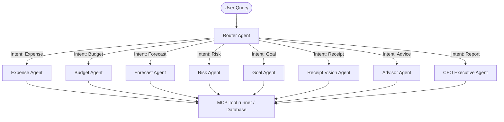

# PocketSense AI — Autonomous Multi-Agent Financial Intelligence Platform

[](https://pocketsense-ai-capstoneproject.vercel.app)
[](https://github.com/mohin-2007/PocketSense-AI)
[](https://kaggle.com)

**PocketSense AI** is a world-class, production-grade Multi-Agent Financial Intelligence Platform built for the **Google × Kaggle AI Agents Intensive Capstone**. It serves as an autonomous personal CFO, risk advisor, receipt scanner, budgeting coach, and predictive financial forecaster.

Rather than being a simple expense tracker, PocketSense AI is an AI-native financial operating system driven by multiple specialist agents, Model Context Protocol (MCP) tools, Gemini intelligence, and a resilient failover architecture.

---

## 🎯 Core Differentiators

*   **"Cursor for Personal Finance" + "Notion AI"**: Natural language interface coupled with structured financial workflows.
*   **Dedicated Judges Mode Console**: Inspect and verify routing maps, active pipeline agents, latencies, and tool success rates in under 60 seconds with an automated one-click walkthrough.
*   **Centralized AI Resilience Layer**: Advanced gateway utilizing exponential backoff retry loops, timeout guards, and a high-fidelity **Offline Fallback Mode** to ensure a 100% demo-proof experience.
*   **Multi-Agent Router & MCP Core**: Automatically orchestrates 9 autonomous specialist agents and 12 registered MCP tools based on user intent.

---

## 🏗️ Multi-Agent Architecture



### Specialist Agents
1.  **Router Agent**: Parses query intent and orchestrates workflow pipelines.
2.  **Expense Agent**: Manages transactions and records (add, update, delete, get).
3.  **Budget Agent**: Manages and checks category-wise limits.
4.  **Forecast Agent**: Predicts future spending habits using regression curves.
5.  **Risk Agent**: Audits accounts for high spend rates and anomalies.
6.  **Goal Agent**: Calculates goal milestones and probability metrics.
7.  **Receipt Vision Agent**: Leverages Gemini Multimodal OCR to parse images into structured transactions.
8.  **Advisor Agent**: Provides financial advice and saving strategies.
9.  **CFO Executive Agent**: Builds structured markdown/PDF-ready reports on monthly finances.

---

## ⚙️ Model Context Protocol (MCP) Server

PocketSense AI includes a standard-compliant MCP server (`mcp-server.js`) that registers **12 schema-validated tools**:

| Tool Name | Parameters | Purpose |
| :--- | :--- | :--- |
| `addExpense` | `amount`, `category`, `description`, `date` | Log a new transaction |
| `updateExpense` | `id`, `updates` | Modify transaction records |
| `deleteExpense` | `id` | Remove a transaction |
| `getExpenses` | None | Retrieve transactions history |
| `setBudget` | `category`, `limit` | Set budget restrictions |
| `getBudget` | None | Fetch active budgets |
| `generateInsights` | None | Extract financial insights |
| `forecastSpending` | None | Run predictive analysis |
| `analyzeRisk` | None | Audit budget deviations |
| `createGoal` | `name`, `target`, `deadline` | Track savings goals |
| `getGoals` | None | Read goals list |
| `scanReceipt` | `imageUrl` or `base64` | Multi-modal OCR ingest |

---

## 🛡️ Telemetry & Resilience Core

### Centralized AI Resilience Gateway (`utils/gemini.js`)
*   **Exponential Backoff**: Generative requests automatically retry up to 3 times with progressive sleep delays (e.g., 400ms, 800ms, 1600ms) upon rate limits (429) or internal errors (500).
*   **Timeout Guard**: Prevents frontend freezes by racing Gemini requests against a strict 8-second execution promise.
*   **Offline Fallback Mode**: If Gemini is unreachable or Demo Mode is toggled, the application seamlessly switches to offline rules containing mock, context-aware financial telemetry.

---

## 🚀 Live Demo & Production URLs

*   **Production App URL**: [pocketsense-ai-capstoneproject.vercel.app](https://pocketsense-ai-capstoneproject.vercel.app)
*   **GitHub Repository**: [github.com/mohin-2007/PocketSense-AI](https://github.com/mohin-2007/PocketSense-AI)

---

## 📥 Getting Started (Local Development)

### Prerequisites
*   Node.js (v18+)
*   npm or yarn

### Installation
1.  Clone the repository:
    ```bash
    git clone https://github.com/mohin-2007/PocketSense-AI.git
    cd PocketSense-AI
    ```
2.  Install dependencies:
    ```bash
    npm install
    ```
3.  Configure your environment:
    Create a `.env` file at the root of the project:
    ```env
    GEMINI_API_KEY=your_gemini_api_key_here
    ```

### Running Locally
To launch the frontend and API endpoints locally, use the Vercel CLI emulator:
```bash
npx vercel dev
```
Open `http://localhost:3000` to interact with the platform.

---

## 🧪 Verification & Testing

Verify that all systems are operational using the built-in test suites:

*   **Run Endpoint Audits**:
    ```bash
    node test_endpoints.js
    ```
    *Tests all 14 serverless API routes, ensuring database read/writes and middleware operate correctly.*

*   **Run Resilience & Failover Tests**:
    ```bash
    node test_resilience.js
    ```
    *Simulates 429 quota exhaustion and validates exponential backoffs and offline fallbacks.*

---

## 📄 License
This project is licensed under the MIT License — see the [LICENSE](LICENSE) file for details.
