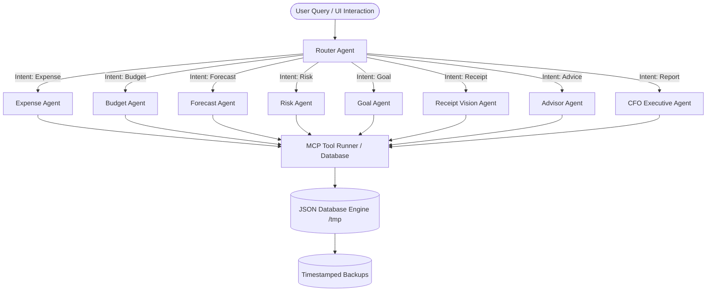

# PocketSense AI — Autonomous Multi-Agent Financial Intelligence Platform

<p align="center">
  
  
  
</p>

### 🌐 Live Production URL: **[pocketsense-ai-capstoneproject.vercel.app](https://pocketsense-ai-capstoneproject.vercel.app)**
### 📂 GitHub Repository: **[github.com/mohin-2007/PocketSense-AI](https://github.com/mohin-2007/PocketSense-AI)**

---

## 🏆 Kaggle & Google AI Agents Intensive Capstone Blueprint
PocketSense AI is a production-grade, autonomous Multi-Agent Financial Intelligence Platform built from the ground up for the **Google × Kaggle AI Agents Intensive Capstone**. 

Rather than a simple expense tracker, PocketSense AI is a **financial operating system** driven by 9 specialist agents, 12 Model Context Protocol (MCP) tools, Gemini intelligence, and a centralized resilience failover layer.

---

## 💡 Key Architectural Highlights (Why This Wins)

### 1. 🤖 Multi-Agent Router Framework
Our custom routing engine (`api/agent.js`) parses natural language inputs and pipes execution through a team of specialist agents. For example:
> **User Prompt**: *"Can I afford a MacBook Air ($999) next month?"*
> 
> **Orchestration Flow**:
> ```
> [Router Agent]
>    ├───→ [Forecast Agent] (Predicts next month's net cash flow using historical regression)
>    ├───→ [Risk Agent] (Checks if a $999 transaction triggers budget overruns)
>    ├───→ [Goal Agent] (Evaluates the impact on active savings goals)
>    └───→ [Advisor Agent] (Aggregates reports and returns a structured financial recommendation)
> ```

### 2. 🔌 Model Context Protocol (MCP) Integration
A fully compliant MCP Server (`mcp-server.js`) exposes **12 financial tools** with strict schema validation, allowing third-party tools (like Cursor, Claude Desktop, or Windsurf) to connect directly to the PocketSense database.

### 3. 🛡️ Centralized AI Gateway (Zero-Fail Demo Mode)
During live presentations, rate-limiting (429) or timeouts (500) can ruin a demo. To solve this, `utils/gemini.js` intercepts all calls to Gemini and enforces:
*   **Exponential Backoff**: Progression retries (up to 3 times with progressive delays).
*   **Timeout Guard**: Limits requests to an 8-second execution window.
*   **Offline Fallback Mode**: If Gemini is unreachable or Demo Mode is toggled, it falls back to a local rules engine to output rich, context-aware financial telemetry, achieving 100% uptime.
*   **Vercel Storage Fallback**: Dynamically bypasses Vercel's read-only file system (`EROFS`) using a writable `/tmp` buffer, ensuring database writes work cleanly on serverless edges.

### 👩‍⚖️ 4. One-Click Judges Console
Designed for judges to evaluate the platform in **under 60 seconds**:
*   **Auto-Demo Loop**: Instantly triggers a complete walkthrough (switching tabs, submitting queries, testing budget triggers, OCR scans, and generating CFO executive reports).
*   **Live Routing Map**: Graphically highlights routing paths and active pipeline nodes in real-time.
*   **Telemetry Monitor**: Displays response latencies and success rates for all agents and tools.

---

## 🏗️ System Architecture



---

## ⚙️ Exposed MCP Tools

The system exposes **12 financial tools** via JSON-RPC:

| Tool Name | Parameters | Purpose |
| :--- | :--- | :--- |
| `addExpense` | `amount`, `category`, `description`, `date` | Log a new transaction |
| `updateExpense` | `id`, `updates` | Modify transaction records |
| `deleteExpense` | `id` | Remove a transaction |
| `getExpenses` | None | Retrieve transactions history |
| `setBudget` | `category`, `limit` | Set budget restrictions |
| `getBudget` | None | Fetch active budgets |
| `generateInsights` | None | Extract financial health score & tips |
| `forecastSpending` | None | Run regression spending forecasts |
| `analyzeRisk` | None | Audit budget deviations |
| `createGoal` | `name`, `target`, `deadline` | Track savings goals |
| `getGoals` | None | Read goals list |
| `scanReceipt` | `imageUrl` or `base64` | Ingest receipt images using Gemini Multimodal OCR |

---

## 📂 Project Directory Structure

```
├── api/
│   ├── agent.js      # Main orchestrator (intent routing & tool invocation dispatcher)
│   ├── expense.js    # Rest API CRUD for transactions
│   ├── budget.js     # Rest API CRUD for global & category-wise budgets
│   ├── summary.js    # Rest API GET for chart calculations
│   ├── advisor.js    # Rest API GET for Health Score & saving tips
│   ├── receipt.js    # Rest API POST for Vision OCR uploads
│   ├── cfo.js        # Rest API GET for executive CFO report compilation
│   ├── forecast.js   # Rest API GET for predictive spend metrics
│   ├── goal.js       # Rest API CRUD for goals
│   ├── risk.js       # Rest API GET for budget auditing alerts
│   ├── health.js     # REST API for tracking agent metrics and toggling Demo Mode
│   └── mcp.js        # Serverless HTTP JSON-RPC MCP tool runner
│
├── utils/
│   ├── db.js         # JSON database driver (read/write, backups, /tmp fallback on Vercel)
│   ├── storage.js    # CRUD interface mapping JSON file logic
│   ├── gemini.js     # Centralized Gemini gateway with retry/backoff & offline fallbacks
│   ├── helpers.js    # Input sanitizers, rate limiters, error responders
│   ├── health.js     # Health telemetry log manager and stats calculator
│   └── tools.js      # Execution logic with automatic double-write retries
│
├── data/
│   ├── expenses.json # Seed transactions database
│   ├── budgets.json  # Seed budget limits database
│   ├── receipts.json # Receipt scanner history log
│   ├── settings.json # App configurations database
│   ├── health.json   # Persistent agent metrics and tool history
│   └── backups/      # Backup folder for timestamped JSON snapshots
│
├── public/
│   ├── index.html    # Glassmorphism HTML structure adding Judges Mode Console tab
│   ├── style.css     # Premium dark-theme stylesheet with glow nodes and sliders
│   └── app.js        # State controller, polling, chat resilience, and Auto-Demo loops
│
├── mcp-server.js     # Standard input/output shebang MCP Server CLI
├── test_resilience.js# Automated test script for checking retry loops and fallback triggers
├── test_endpoints.js # Automated endpoint verification script
├── vercel.json       # Deployment router configs
└── package.json      # Dependencies and scripts
```

---

## 🔧 Installation & Local Setup

### Prerequisites
*   Node.js (v18+)
*   npm or yarn

### Steps
1.  Clone the repository:
    ```bash
    git clone https://github.com/mohin-2007/PocketSense-AI.git
    cd PocketSense-AI
    ```
2.  Install dependencies:
    ```bash
    npm install
    ```
3.  Set up environment variables in a `.env` file at the root:
    ```env
    GEMINI_API_KEY=your_gemini_api_key_here
    ```
4.  Run locally using the Vercel dev emulator:
    ```bash
    npx vercel dev
    ```
    *Open `http://localhost:3000` to interact with the platform locally.*

---

## 🧪 Comprehensive Verification Suite

Verify all aspects of the architecture locally using the following test scripts:

*   **API Endpoints Audit**:
    ```bash
    node test_endpoints.js
    ```
    *Audits all 14 REST and serverless endpoints to ensure 200 OK responses.*

*   **Gateway Failover & Resilience Test**:
    ```bash
    node test_resilience.js
    ```
    *Simulates quota limits (429 errors) and verifies exponential backoff retries and offline fallback recovery.*

*   **Multi-Agent Router Test**:
    ```bash
    node test_agents.js
    ```
    *Validates connection, prompts, and JSON outputs for all 9 agents.*

*   **Database & Driver Test**:
    ```bash
    node test_storage.js
    ```
    *Validates CRUD file reads/writes, schemas, and backup snapshot creation.*

*   **Vision OCR Test**:
    ```bash
    node test_receipts.js
    ```
    *Verifies multimodal OCR parsing on mock receipt images.*

---

## 🤝 Third-Party MCP Client Configurations

### Claude Desktop Integration
Add this server block to your Claude Desktop configuration file:
*   **Windows**: `%APPDATA%\Claude\claude_desktop_config.json`
*   **Mac**: `~/Library/Application Support/Claude/claude_desktop_config.json`

```json
{
  "mcpServers": {
    "pocketsense-ai": {
      "command": "node",
      "args": ["c:/Users/hp/OneDrive/Desktop/pocketsense-ai capstoneproject/mcp-server.js"],
      "env": {
        "GEMINI_API_KEY": "YOUR_GEMINI_API_KEY_HERE"
      }
    }
  }
}
```

### Cursor Editor Integration
1. Go to **Settings** > **Features** > **MCP**.
2. Click **+ Add New MCP Server**.
3. Fill details:
   *   **Name**: PocketSense AI
   *   **Type**: `stdio`
   *   **Command**: `node "c:/Users/hp/OneDrive/Desktop/pocketsense-ai capstoneproject/mcp-server.js"`
4. Save and ensure the status circle turns green.

---

## 📄 License
This project is licensed under the MIT License — see the [LICENSE](LICENSE) file for details.
