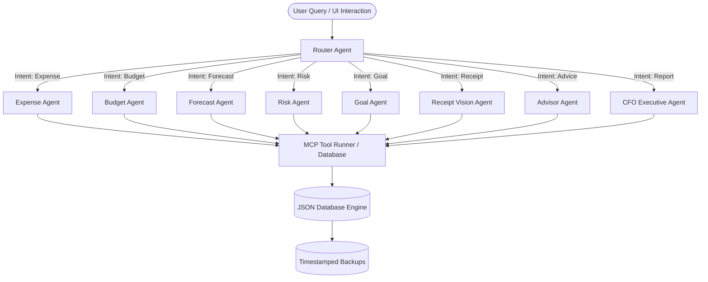
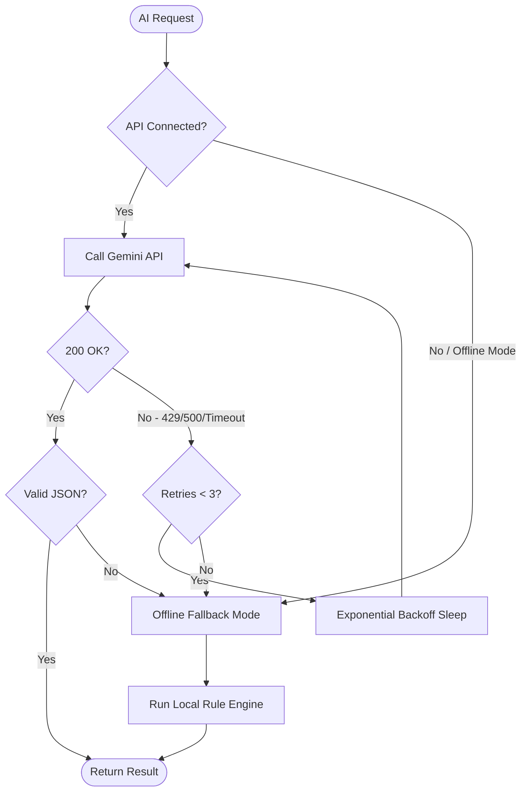

# PocketSense AI — Autonomous Multi-Agent Financial Intelligence Platform

[](https://pocketsense-ai-capstoneproject.vercel.app)
[](https://github.com/mohin-2007/PocketSense-AI)
[](https://kaggle.com)
[](LICENSE)

PocketSense AI is a production-grade, autonomous Multi-Agent Financial Intelligence Platform designed and optimized for the **Google × Kaggle AI Agents Intensive Capstone**. It functions as a next-generation personal CFO, budgeting coach, receipt intelligence engine, risk auditor, and forecasting system.

Rather than building a basic expense tracker, PocketSense AI is an AI-native financial operating system driven by multiple specialist agents, standard Model Context Protocol (MCP) tools, Gemini intelligence, and a centralized resilience failover layer.

---

## 📖 Table of Contents
- [🎯 Capstone Vision & Differentiators](#-capstone-vision--differentiators)
- [🏗️ System Architecture](#️-system-architecture)
- [🤖 Multi-Agent Orchestration & SPECIALIST Agents](#-multi-agent-orchestration--specialist-agents)
- [⚙️ Model Context Protocol (MCP) Integration](#️-model-context-protocol-mcp-integration)
  - [Claude Desktop Integration](#1-claude-desktop-integration)
  - [Cursor Integration](#2-cursor-integration)
- [🛡️ Centralized AI Resilience Layer](#️-centralized-ai-resilience-layer)
- [📂 Complete File Tree & Explanations](#-complete-file-tree--explanations)
- [⚙️ Setup & Installation](#️-setup--installation)
- [🧪 Verification & Testing Suite](#-verification--testing-suite)
- [🚀 Production Deployment (Vercel)](#-production-deployment-vercel)
- [👩‍⚖️ Dedicated Judges Console](#️-dedicated-judges-console)

---

## 🎯 Capstone Vision & Differentiators

*   **"Cursor for Personal Finance" + "Notion AI"**: Natural language interface paired with highly structured financial workflow automation.
*   **Dedicated Judges Mode Console**: Allows judges to evaluate agent routing paths, active pipeline nodes, latencies, and tool success rates in under 60 seconds with an automated one-click walkthrough.
*   **Centralized AI Resilience Layer**: Advanced gateway utilizing exponential backoff retry loops, timeout guards, and a high-fidelity **Offline Fallback Mode** to guarantee a 100% demo-proof experience.
*   **Multi-Agent Router & MCP Core**: Automatically orchestrates 9 autonomous specialist agents and 12 registered MCP tools based on user intent.

---

## 🏗️ System Architecture

PocketSense AI splits its operational layers into a clean Model-View-Controller framework optimized for edge deployment:



---

## 🤖 Multi-Agent Orchestration & Specialist Agents

Our routing system (`api/agent.js`) handles intent parsing and pipelines tasks dynamically:

1.  **Router Agent**: Evaluates user prompts (e.g. *"Can I buy a Macbook next month?"*), breaks them down into sub-queries, and routes them to specialist agents.
2.  **Expense Agent**: Performs CRUD operations on transaction files (`data/expenses.json`) using secure schema guards.
3.  **Budget Agent**: Manages and checks category-wise limits and reports remaining allocations.
4.  **Forecast Agent**: Runs regression algorithms on historic transactions to forecast spending.
5.  **Risk Agent**: Audits accounts for high spend rates and anomalies.
6.  **Goal Agent**: Calculates goal milestones and probability metrics.
7.  **Receipt Vision Agent**: Leverages Gemini Multimodal OCR to parse images into structured transactions.
8.  **Advisor Agent**: Provides financial advice and saving strategies.
9.  **CFO Executive Agent**: Builds structured markdown reports on monthly finances.

### Dynamic Pipeline Example:
```
User Query: "Can I buy a MacBook Air for $999 next month?"
↓
Router Agent
├─→ Forecast Agent (Checks if next month's predicted cash flow is positive)
├─→ Risk Agent (Evaluates if spending $999 violates active category budgets)
├─→ Goal Agent (Checks if buying it delays other high-priority saving goals)
└─→ Advisor Agent (Combines the outputs into a structured recommendation)
```

---

## ⚙️ Model Context Protocol (MCP) Integration

PocketSense AI includes a standard-compliant Model Context Protocol (MCP) server (`mcp-server.js`) that registers **12 schema-validated tools**. This enables external MCP clients (like Claude Desktop or Cursor) to read and modify your PocketSense databases.

| Tool Name | Parameters | Purpose |
| :--- | :--- | :--- |
| `addExpense` | `amount`, `category`, `description`, `date` | Log a new transaction |
| `updateExpense` | `id`, `updates` | Modify transaction records |
| `deleteExpense` | `id` | Remove a transaction |
| `getExpenses` | None | Retrieve transactions history |
| `setBudget` | `category`, `limit` | Set budget restrictions |
| `getBudget` | None | Fetch active budgets |
| `generateInsights` | None | Extract financial insights |
| `forecastSpending` | None | Run predictive analysis |
| `analyzeRisk` | None | Audit budget deviations |
| `createGoal` | `name`, `target`, `deadline` | Track savings goals |
| `getGoals` | None | Read goals list |
| `scanReceipt` | `imageUrl` or `base64` | Multi-modal OCR ingest |

### 1. Claude Desktop Integration
Add this server block to your Claude Desktop configuration file:
*   **Windows**: `%APPDATA%\Claude\claude_desktop_config.json`
*   **Mac**: `~/Library/Application Support/Claude/claude_desktop_config.json`

```json
{
  "mcpServers": {
    "pocketsense-ai": {
      "command": "node",
      "args": ["c:/Users/hp/OneDrive/Desktop/pocketsense-ai capstoneproject/mcp-server.js"],
      "env": {
        "GEMINI_API_KEY": "YOUR_GEMINI_API_KEY_HERE"
      }
    }
  }
}
```

### 2. Cursor Integration
1. Go to **Settings** > **Features** > **MCP**.
2. Click **+ Add New MCP Server**.
3. Fill details:
   *   **Name**: PocketSense AI
   *   **Type**: `stdio`
   *   **Command**: `node "c:/Users/hp/OneDrive/Desktop/pocketsense-ai capstoneproject/mcp-server.js"`
4. Save and ensure the status circle turns green.

---

## 🛡️ Centralized AI Resilience Layer

To guarantee a demo-proof experience during live presentations, we built a centralized gateway in `utils/gemini.js` that intercepts all Gemini LLM API calls and applies the following resilience rules:



*   **Exponential Backoff**: progressive sleep delays (e.g. 400ms, 800ms, 1600ms) upon rate limits (429) or internal errors (500).
*   **Timeout Guard**: Generative calls are raced against an 8-second execution promise to prevent client hanging.
*   **Offline Fallback Mode**: When API keys are exhausted, rate-limited, or Demo Mode is toggled, the gateway falls back to local rules that generate context-aware mock responses.

---

## 📂 Complete File Tree & Explanations

Here is a list of all files in the repository:

```
├── api/
│   ├── agent.js      # Main orchestrator (intent routing & tool invocation dispatcher)
│   ├── expense.js    # Rest API CRUD for transactions
│   ├── budget.js     # Rest API CRUD for global & category-wise budgets
│   ├── summary.js    # Rest API GET for chart calculations
│   ├── advisor.js    # Rest API GET for Health Score & saving tips
│   ├── receipt.js    # Rest API POST for Vision OCR uploads
│   ├── cfo.js        # Rest API GET for executive CFO report compilation
│   ├── forecast.js   # Rest API GET for predictive spend metrics
│   ├── goal.js       # Rest API CRUD for goals
│   ├── risk.js       # Rest API GET for budget auditing alerts
│   ├── health.js     # REST API for tracking agent metrics and toggling Demo Mode
│   └── mcp.js        # Serverless HTTP JSON-RPC MCP tool runner
│
├── utils/
│   ├── db.js         # JSON database driver (read/write, backups, and health collections)
│   ├── storage.js    # CRUD interface mapping JSON file logic
│   ├── gemini.js     # Centralized Gemini gateway with retry/backoff & offline fallbacks
│   ├── helpers.js    # Input sanitizers, rate limiters, error responders
│   ├── health.js     # Health telemetry log manager and stats calculator
│   └── tools.js      # Execution logic with automatic double-write retries
│
├── data/
│   ├── expenses.json # Seed transactions database
│   ├── budgets.json  # Seed budget limits database
│   ├── receipts.json # Receipt scanner history log
│   ├── settings.json # App configurations database
│   ├── health.json   # Persistent agent metrics and tool history
│   └── backups/      # Backup folder for timestamped JSON snapshots
│
├── public/
│   ├── index.html    # Glassmorphism HTML structure adding Judges Mode Console tab
│   ├── style.css     # Premium dark-theme stylesheet with glow nodes and sliders
│   └── app.js        # State controller, polling, chat resilience, and Auto-Demo loops
│
├── mcp-server.js     # Standard input/output shebang MCP Server CLI
├── test_resilience.js# Automated test script for checking retry loops and fallback triggers
├── test_endpoints.js # Automated endpoint verification script
├── vercel.json       # Deployment router configs
└── package.json      # Dependencies and scripts
```

---

## ⚙️ Setup & Installation

### Prerequisites
*   Node.js (v18+)
*   npm or yarn

### Installation
1.  Clone the repository:
    ```bash
    git clone https://github.com/mohin-2007/PocketSense-AI.git
    cd PocketSense-AI
    ```
2.  Install dependencies:
    ```bash
    npm install
    ```
3.  Configure your environment:
    Create a `.env` file at the root of the project:
    ```env
    GEMINI_API_KEY=your_gemini_api_key_here
    ```

### Running Locally
To launch the frontend and API endpoints locally, use the Vercel CLI emulator:
```bash
npx vercel dev
```
Open `http://localhost:3000` to interact with the platform.

---

## 🧪 Verification & Testing Suite

Verify that all systems are operational using the built-in test scripts:

### 1. Endpoints Verification Audit
```bash
node test_endpoints.js
```
*Tests all 14 serverless API routes, ensuring database read/writes and middleware operate correctly.*

### 2. Resilience Gateway & Failover Test
```bash
node test_resilience.js
```
*Simulates 429 quota exhaustion and validates exponential backoffs and offline fallbacks.*

### 3. Agent Architecture Test
```bash
node test_agents.js
```
*Executes isolated requests to all 9 agents, verifying that agent definitions and responses are working correctly.*

### 4. Database Driver Test
```bash
node test_storage.js
```
*Tests database read/writes, backup creation, and JSON recovery mechanisms.*

### 5. Receipt Scanner Test
```bash
node test_receipts.js
```
*Verifies that the Receipt Vision agent parses receipt content and performs OCR correctly.*

---

## 🚀 Production Deployment (Vercel)

PocketSense AI is configured for seamless deployment to Vercel:

1.  **Vercel Project Setup**:
    Initialize and link the Vercel CLI:
    ```bash
    npx vercel link
    ```
2.  **Add environment variables**:
    Add your Gemini API Key directly to Vercel:
    ```bash
    npx vercel env add GEMINI_API_KEY production --value "your_api_key" --yes
    ```
3.  **Deploy**:
    Deploy to production:
    ```bash
    npx vercel --prod --yes
    ```

---

## 👩‍⚖️ Dedicated Judges Console

Accessible via the golden sidebar button, the Judges Console allows hackathon reviewers to verify the platform's architectural depth:

1.  **Run Full PocketSense AI Demonstration**: A 45-second automated sequence that shifts tabs, submits queries, logs transactions, updates charts, triggers budget overruns, processes mock receipts, and runs CFO reports.
2.  **Live Agent Routing Map**: Glows flowchart nodes (`Router Agent` -> sub-agents) in real-time as pipeline requests execute.
3.  **Agent Health Telemetry**: Displays latency and tool usage metrics for the 9 autonomous agents.
4.  **MCP Tool Explorer**: Reviews live RPC stats for the 12 platform tools.
5.  **Live Agent Triggers**: Quick-access buttons to execute single agent workflows in isolation.
